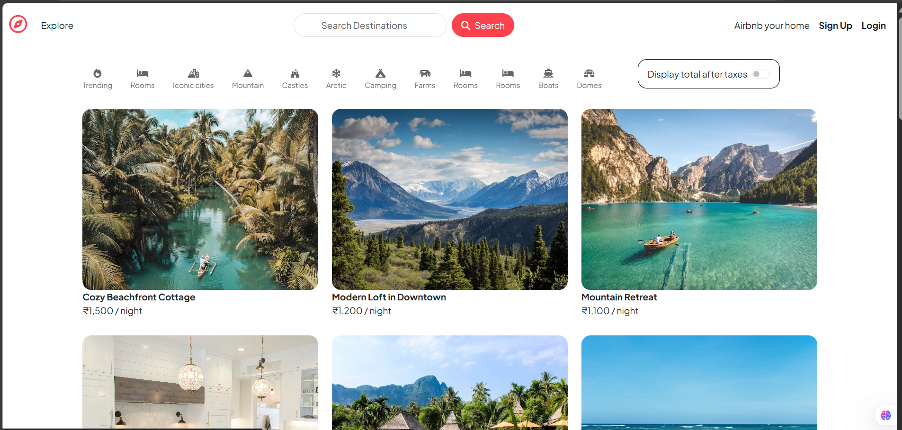

# 🏨 Hotel Discovery and Listing Platform

[🌐 Live Demo](https://wanderlust-3qq5.onrender.com/listings) • [📂 GitHub Repository](https://github.com/bhusareMayur/wanderlust)

---

## 🧭 Project Overview

**MERN Stack Hotel Discovery Platform** using MVC architecture. Users can:
- 🔍 Search and explore hotel listings
- 📄 View detailed information and leave reviews
- 📝 Hosts can add and manage listings (descriptions, images, amenities)

🔐 The system includes secure authentication, a responsive UI, and scalable RESTful APIs.

> ⚠️ **Note:** Booking functionality is not included. The focus is on property discovery and user engagement.

---

## 🚀 Tech Stack

- **Backend:** Node.js, Express.js, MongoDB (Atlas), MVC
- **Frontend:** EJS Templates, HTML, CSS, JavaScript
- **Authentication:** Passport.js, Sessions, Authorization
- **APIs:** RESTful API design

---

## 🖼️ Preview



---

## 💻 How to Run This Project Locally

### 🔁 Clone the Repository

```bash
git clone https://github.com/bhusareMayur/wanderlust.git
cd wanderlust
```

### 📦 Install Dependencies

```bash
npm install
```

### 🔑 Environment Setup

Create a `.env` file in the root folder and add the following:

```env
DB_URL=your_mongodb_url
SECRET=your_session_secret
CLOUDINARY_KEY=your_cloudinary_key
CLOUDINARY_SECRET=your_cloudinary_secret
```

### 🚀 Start the App

```bash
npm start
```

Visit: `http://localhost:3000/listings`

---

## 📁 Folder Structure

```bash
wanderlust/
├── controllers/      # Route logic and controller functions
├── models/           # Mongoose schemas
├── routes/           # All Express routes
├── views/            # EJS templates
├── public/           # Static files (CSS, JS, images)
├── utils/            # Helper utilities
├── app.js            # Main app entry point
└── .env              # Environment variables
```

---

## 🔐 Features

- ✅ User Authentication (Login/Register)
- 🏨 Property Listings CRUD for Hosts
- 📸 Image Upload via Cloudinary
- 🔍 Search Functionality
- 💬 Review System
- ☁️ Deployment Ready (Hosted on Render)

---

## 📌 Tags

`mongodb` `authentication` `mvc-architecture` `authorization` `node-js` `restful-api` `express-js` `ejs-templates` `mongodb-atlas`

---

## 👨‍💻 Author

**Mayur Bhusare**  
📧 mayurbhusare8262@gmail.com  
🔗 [LinkedIn](https://www.linkedin.com/in/mayur-bhusare)  
🌐 [Portfolio](https://bhusaremayur.github.io/portfolio/)

---

## 📃 License

Licensed under the [MIT License](LICENSE).

> 🌟 Star this repo if you found it helpful!
